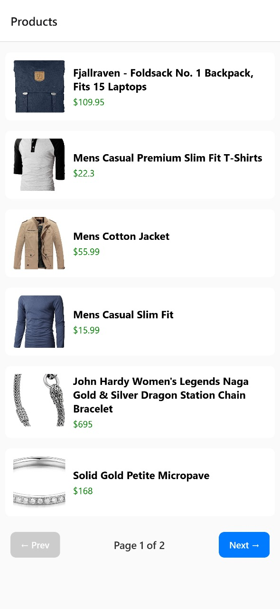
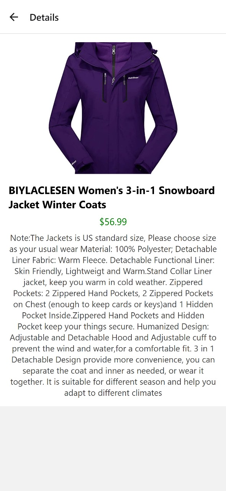

# 📱 Multiplatform Product Viewer App

This is a **React Native Expo** application built to fulfill a multiplatform mobile application development. The app fetches products from a public API and displays them in a clean, paginated list. Users can tap on any product to view more details.

## 📸 Demo
<p align="center">
  
  
</p>


## 🎯 Challenge Requirements

- ✅ Multiplatform support (via React Native + Expo)
- ✅ Fetch data from public API
- ✅ Display product image, title, and price
- ✅ Handle loading and error states
- ✅ Pagination (6 per page)
- ✅ Product detail screen
- ✅ Clean project structure (separation of concerns)

## Setup
1. Clone the repository:

 ```bash
   git clone https://github.com/omprakashsao/Multiplatform-Product-Viewer-App.git
```

2. Change Directory:
    ```bash
   cd ProductListApp
```
3. Install dependencies:
 ```bash
  npm install
```

4. Start the Expo server:
 ```bash
 npx expo start
```


Open in Expo Go app (iOS/Android) 

## 🛠 Built With

- React Native

- Expo

- React Navigation

- Axios

- Context API

## ✨ Features

- Pagination (6 per page)

- Product detail view

- Clean, componentized architecture
